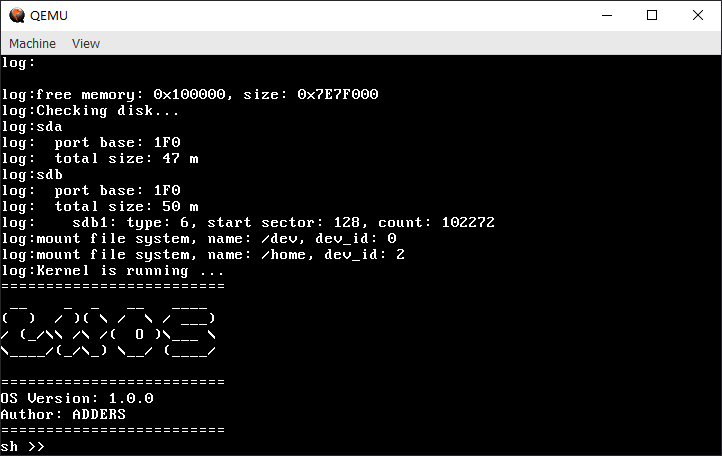

# LightWeightOS

## A 32-bit Multi-Process Operating System for QEMU x86 Virtual Environment



LightWeightOS is a lightweight, 32-bit multi-process operating system developed to run in a QEMU x86 virtual environment. It features a comprehensive set of system calls, multi-process support, file system capabilities, and an interactive shell interface.

## Key Features

- **Multi-Process Support**: Time-slice rotation scheduling ensures concurrent process execution
- **Memory Management**: Page-based virtual memory with process isolation
- **Device Abstraction**: Unified interface for device access
- **File System Support**: Mounted filesystems including a device filesystem and FAT16
- **Process Synchronization**: Semaphores and mutexes for inter-process communication
- **Interactive Shell**: 8 terminal windows with common command support
- **System Call Interface**: 22 system calls for process management and file operations

## System Architecture

LightWeightOS follows a layered architecture design:

1. **Boot Loader**
   - Enters 32-bit protected mode
   - Enables paging mechanism
   - Performs hardware detection
   - Loads the kernel

2. **Kernel Components**
   - **Multi-Process Management**: Uses TSS for process switching
   - **Interrupt Management**: Custom handlers with extensible IDT
   - **Device Management**: Abstraction layer for uniform device access
   - **File System**: Manages both device and disk filesystems
   - **Memory Management**: Segment-page memory model with privilege protection
   - **Process Synchronization**: IPC mechanisms
   - **System Call Interface**: Gate-based system call implementation

## System Call API

### Process Management
```c
int msleep(int ms);                                       // Sleep for milliseconds
int fork(void);                                           // Create a new process
int getpid(void);                                         // Get process ID
int yield(void);                                          // Yield CPU voluntarily
int execve(const char *name, char * const *argv, char * const *env); // Execute program
int print_msg(char * fmt, int arg);                       // Print formatted message
int wait(int* status);                                    // Wait for child process
void *exit(int status);                                   // Exit process
void sbrk(ptrdifft incr);                                 // Adjust heap size
```

### File System Operations
```c
int open(const char *name, int flags, ...);               // Open file
int read(int file, char *ptr, int len);                   // Read from file
int write(int file, char *ptr, int len);                  // Write to file
int close(int file);                                      // Close file
int lseek(int file, int ptr, int dir);                    // Reposition file offset
int isatty(int file);                                     // Test for terminal device
int fstat(int file, struct stat *st);                     // Get file status
int dup(int file);                                        // Duplicate file descriptor
int ioctl(int fd, int cmd, int arg0, int arg1);           // Device control
DIR * opendir(const char * name);                         // Open directory
struct dirent* readdir(DIR* dir);                         // Read directory entry
int closedir(DIR *dir);                                   // Close directory
int unlink(const char *pathname);                         // Remove file
```

## Shell Environment

LightWeightOS includes a command-line interpreter (shell) that provides a user interface to interact with the operating system. The shell supports:

- **Built-in Commands**:
  - `help` - Display available commands
  - `clear` - Clear the terminal screen
  - `echo` - Display text
  - `ls` - List directory contents
  - `less` - View file contents
  - `cp` - Copy files
  - `rm` - Remove files

- **Program Execution**: Load and execute binary files from disk

## File System Structure

LightWeightOS mounts two filesystems:
- `/dev` - Device filesystem
- `/home` - FAT16 filesystem for user files

## Memory Protection

The system implements segment-page memory management to:
- Isolate processes from the OS kernel
- Protect code based on privilege levels
- Provide each process with its own page table and virtual memory space
- Ensure inter-process isolation

---

*LightWeightOS is a demonstration of operating system fundamentals including process management, memory protection, filesystem operations, and system call interfaces.*